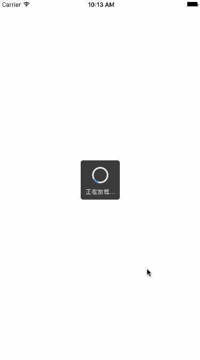
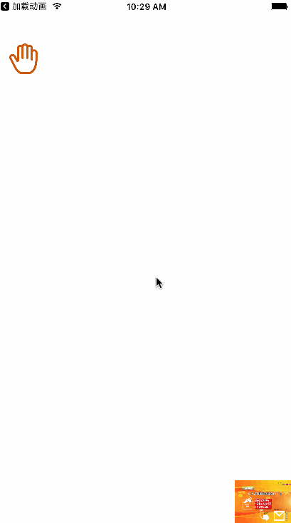
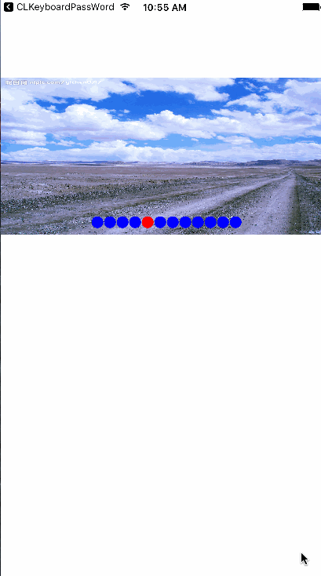
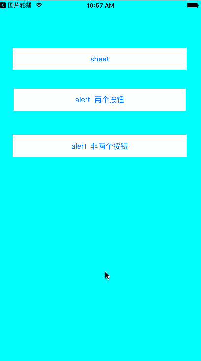
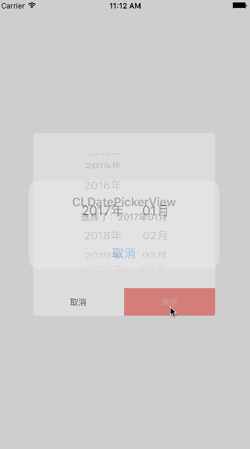
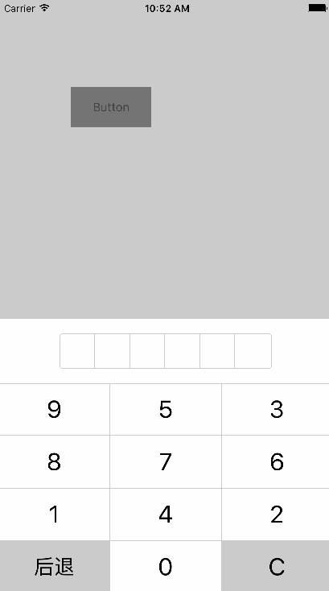

[# 里面的Demo都没有进行封装

###一、mytaobao  模仿的淘宝中  我的淘宝界面的双波浪图 
##### 技术博客：地址 [模仿我的淘宝双波浪线和翻页效果](http://www.jianshu.com/p/c1dbcc3aa775)


###二、加载动画 支付宝里面的加载动画效果





###三、模仿淘宝选择购物车 模仿淘宝选择颜色、尺码界面  并加入购物车抛物线动画





### 四、图片轮播  三张imageView 相互切换实现的





使用方法
```
- (void)viewDidLoad {
    [super viewDidLoad];
  
    CGRect frame = CGRectMake(0, 100, self.view.frame.size.width, 200);
    
    NSArray *imageArr = @[@"1.jpg",@"2.png",@"3.jpg",@"4.jpg",@"1.jpg",@"2.png",@"3.jpg",@"4.jpg",@"1.jpg",@"2.png",@"3.jpg",@"4.jpg"];
    
    CLCycleView *cycleView = [[CLCycleView alloc] initWithFrame:frame duration:3 imageArr:imageArr];
    cycleView.delegate = self;
    cycleView.currentPageIndicatorTintColor = [UIColor redColor];
    cycleView.pageIndicatorTintColor = [UIColor blueColor];
    cycleView.diameter = 20;
    cycleView.cycleView = ^(NSInteger indexPage) {
        NSLog(@"block显示点击%ld张图片",indexPage);
    };
    
    self.cycleView = cycleView;
    [self.view addSubview:cycleView];
  
}


#pragma mark - cycleViewDelegate
- (void)cycleViewDidSelected:(NSInteger)pageIndex {
    
     NSLog(@"delegate显示点击%ld张图片",pageIndex);
    [self.cycleView stop];
    
    UIAlertController *alert = [UIAlertController alertControllerWithTitle:@"CLCycleView" message:[NSString stringWithFormat:@"点击了第%ld张图片,并且停止播放",pageIndex] preferredStyle:UIAlertControllerStyleAlert];
    
    [alert addAction:[UIAlertAction actionWithTitle:@"开始轮播" style:UIAlertActionStyleDefault handler:^(UIAlertAction * _Nonnull action) {
        
        [self.cycleView start];
        
        
    }]];
    
    
    [self presentViewController:alert animated:YES completion:nil];
}

```


### 五、AlertController 模仿微信的弹出框





调用方法和UIAlertController一样
```
    CLAlertController *alert = [CLAlertController alertControllerWithTitle:@"更改头像" message:@"选择方式如下：各种小魔头这是一个AlertController 用来学习用的这是一个AlertController 用来学习用的这是一个AlertController 用来学习用的" preferredStyle:CLAlertControllerStyleSheet];

    [alert addAction:[CLAlertModel actionWithTitle:@"打开相机" style:CLAlertActionStyleDefault handler:^(CLAlertModel *action) {
        
    }]];
    
    [alert addAction:[CLAlertModel actionWithTitle:@"保存照片" style:CLAlertActionStyleDefault handler:^(CLAlertModel *action) {
        
    }]];
    
    [alert addAction:[CLAlertModel actionWithTitle:@"打开相册" style:CLAlertActionStyleDestructive handler:^(CLAlertModel *action) {
        
    }]];
    
    [alert addAction:[CLAlertModel actionWithTitle:@"取消" style:CLAlertActionStyleCancel handler:^(CLAlertModel *action) {
        
    }]];
    
    
    
    [self presentToViewController:alert completion:nil];
```


### 六、CLDataPickerController 这个是年月选择器  内部用UIPickView实现的





使用方法
```
- (void)touchesBegan:(NSSet<UITouch *> *)touches withEvent:(UIEvent *)event {
    
    CLDatePickerView *datePicker = [[CLDatePickerView alloc] init];
    datePicker.delegate = self;
    [self.view addSubview:datePicker];
    
}

// 这个是代理方法
- (void)datePickerView:(CLDatePickerView *)datePickerView didSelectedItem:(NSString *)year month:(NSString *)month {
    
    UIAlertView *alertView = [[UIAlertView alloc] initWithTitle:@"CLDatePickerView" message:[NSString stringWithFormat:@"选择了：%@年%@月",year,month] delegate:nil cancelButtonTitle:@"取消" otherButtonTitles:nil];
    [alertView show];
    
}
```


### 七、CLKeyboardPassWord 这个是密码键盘  下面的数字是随机生成的  对支付时输入密码更安全 调用只需要




使用方法


```
    key = [[CLKeyBoardPassWord alloc] initWithPassword:^(NSString *password) {
        
        UIAlertView *alert = [[UIAlertView alloc] initWithTitle:@"密码" message:password delegate:self cancelButtonTitle:nil otherButtonTitles:@"确定", nil];
        
        [alert show];
        
    } backBlock:^(UIView *view) {
        
      [key dismiss];
        
    }];
    [key show];
```

### 八、CLPhotoWall 这个是仿照微信的多选图片 


使用方法

```
可以用Cocoapods导入  pod "CLPhotoWall"

```


```
/*****************************************************************************/
/***************************下面是完成多选照片的方法*******************************/
/*****************************************************************************/

    // 多张选择图片需要调用的方法如下
    // 1、通过通知来获取图片
    [[NSNotificationCenter defaultCenter] addObserver:self selector:@selector(choosePhoto:) name:CLPhotoAssetSelectImageNotificationName object:nil];
    
}

//2、 实现通知方法  获取图片
- (void)choosePhoto:(NSNotification *)noti {
    
    
    // 内部存放的是CLPhotoAssetInfo的对象
    
    /*
     @property (nonatomic, strong) PHAsset *asset;
     @property (nonatomic, strong) UIImage *nomalImage;
     @property (nonatomic, strong) UIImage *largeImage;
     */
    
    NSArray *images = noti.userInfo[CLPhotoAssetSelectImageNotificationUserInfoKey];
    
    
    [self.dataSource addObjectsFromArray:images];
    
    [self.collectionView reloadData];
    
    NSLog(@"%@",images);
    
    
}

//3、 跳转到图片选择界面
- (void)selectImage {
    
    CLPhotoAlbumViewController *albumVC = [[CLPhotoAlbumViewController alloc] init];
    albumVC.maxCount = 3;
    albumVC.didSelectCount = self.dataSource.count;
    [self.navigationController presentViewController:[[UINavigationController alloc] initWithRootViewController:albumVC] animated:YES completion:nil];
    
}

/*****************************************************************************/
/****************************上面是完成多选照片的方法******************************/
/*****************************************************************************/

```


[最后附Demo地址](https://github.com/qcl901028/CustomView)
欢迎各位伙伴们的Star