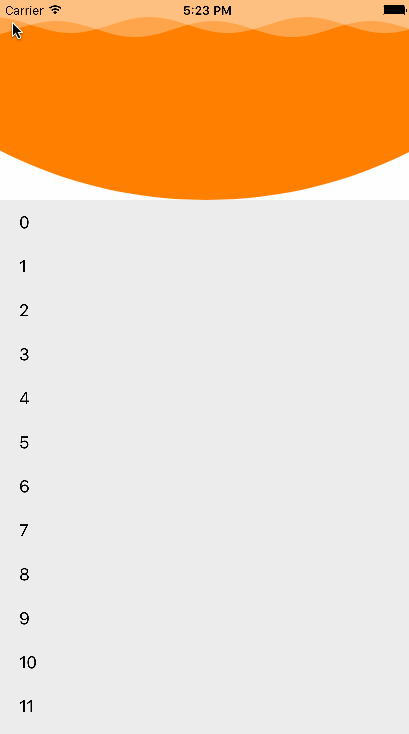
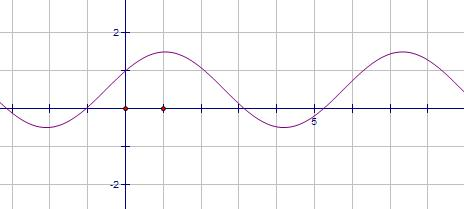
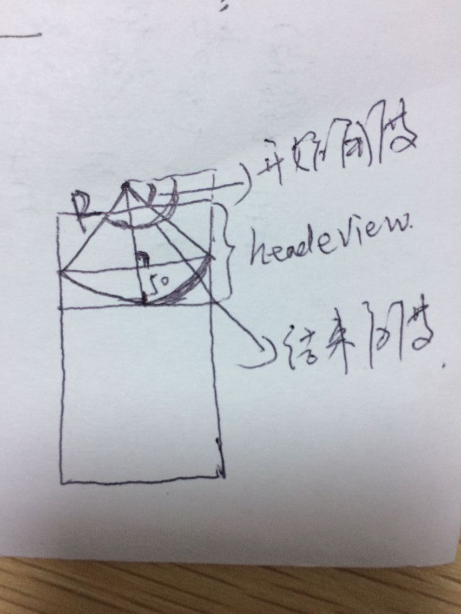

###淘宝我的界面波浪线
######先看图片





demo没进行封装，内容的实现主要使用了CADisplayLink定时器，UIBezierPath结合CAShaperLayer 实现的双波浪效果，用了Model转场动画实现的下拉跳转界面

整体来说不是太难  难的地方在于用UIBezierPath绘制下面的弧形时需要手动计算弧形的坐标。


实现方法 ：
##### 一、 首先要知道下面这个公式：
```
y = Asin(wx+Q) + S;
```


对应的图片是这样的





```
A 表示峰值，忘记数学怎么称呼了(知道的大咖给说下，谢谢) 及最大值和最小值 由于sin(wx + Q)的区间是[-1,1]；所以Asin(wx + Q)的区间就是[-A,A];
```
```

W 表示周期 w越大周期T越小 我取的是0.04；
```

```
Q 是用来调整曲线的左右位置
```

```
S 是用来调整上下的位置
```

##### 二、绘制波浪线


```
- (UIBezierPath *)getWavePath:(CGFloat)A W:(CGFloat)w d:(CGFloat)d dong:(CGFloat)dong{
    
    UIBezierPath *path = [UIBezierPath bezierPath];
    [path moveToPoint:CGPointMake(0, 0)];
    [path addLineToPoint:CGPointMake(0, 50)];
    
    for (int i = 0; i < [UIScreen mainScreen].bounds.size.width; i++) {
        
        // 这个是波浪线绘制的主要代码   
        CGFloat y = A*sinf(i*w +dong+self.dong)+d;
        
        
        [path addLineToPoint:CGPointMake(i, y)];
    }
    
    [path addLineToPoint:CGPointMake([UIScreen mainScreen].bounds.size.width, 0)];
    [path closePath];
    return path;

}
```

接着先创建一个TableView的头视图View
```
    UIView *view = [[UIView alloc] initWithFrame:CGRectMake(0, 0, [UIScreen mainScreen].bounds.size.width, 260)];
    view.backgroundColor = [UIColor whiteColor];
    self.headerView = view;
    self.tableView.tableHeaderView = self.headerView;
```

创建CAShaperLayer 添加到TableView的头视图上 这样就创建了一个波浪线  

```
    CAShapeLayer *layer = [CAShapeLayer layer];
    layer.fillColor = [UIColor whiteColor].CGColor;
    layer.frame = view.bounds;
    layer.opacity = 0.3; // 透明度
    layer.shouldRasterize = YES;  // 加个注释 这个是让曲线能平滑过渡，防止有锯齿状
    layer.path = [self getWavePath:8 W:0.04 d:25+60 dong:0].CGPath;
    self.shapeLayer = layer;
    [view.layer addSublayer:layer];
```
因为淘宝有两个波浪线  还需要创建一个  没封装  所以又粘贴了一遍

```
  CAShapeLayer *layer1 = [CAShapeLayer layer];
    layer1.fillColor = [UIColor whiteColor].CGColor;
    layer1.frame = view.bounds;
    layer1.opacity = 0.3;
    layer1.shouldRasterize = YES;
    layer1.path = [self getWavePath:8 W:0.04 d:29+60 dong:10].CGPath;
    self.shapeLayer1 = layer1;
    [view.layer addSublayer:layer1];

```
但是淘宝的波浪会动啊  怎么办？ 这个时候我们就需要定时器 CADisplayLink 来控制波浪的波动，这个主要用来动画的处理，NSTimer貌似会简短，具体的区别请看:([CADisplayLink](http://www.jianshu.com/p/c35a81c3b9eb)）

```
    _displayLink = [CADisplayLink displayLinkWithTarget:self selector:@selector(disPlayLink:)];
    [_displayLink addToRunLoop:[NSRunLoop currentRunLoop] forMode:NSRunLoopCommonModes];
    
- (void)disPlayLink:(CADisplayLink *)displayLink {
    self.dong = self.dong+0.05;
    self.shapeLayer.path = [self getWavePath:8 W:0.04 d:25+60 dong:0].CGPath;
    self.shapeLayer1.path = [self getWavePath:8 W:0.04 d:29+60 dong:10].CGPath;
}
    
```

这样你会神器的发现双波浪动画就实现了

##### 三、绘制下面的圆弧





代码

```
- (UIBezierPath *)getLayerBezierPath {

    CGFloat width = [UIScreen mainScreen].bounds.size.width;
    CGFloat R = 25+pow(width, 2)/400.0f;
    CGPoint centerArc = CGPointMake(width/2.0f,260-R);
    
    UIBezierPath *bezierPath = [UIBezierPath bezierPath];
    [bezierPath moveToPoint:CGPointMake(0, 0)];
    [bezierPath addLineToPoint:CGPointMake(0, 210)];
    
    // acos() 这个就是数学里面的arccos();
    [bezierPath addArcWithCenter:centerArc radius:R startAngle:acos(width/(2*R)) endAngle:(M_PI-acos(width/(2*R))) clockwise:YES];
    [bezierPath addLineToPoint:CGPointMake(width, 210)];
    [bezierPath addLineToPoint:CGPointMake(width, 0)];
    [bezierPath closePath];
    
    return bezierPath;

}

```
创建一个layer扔到headerView上

```
    CAShapeLayer *layer2 = [CAShapeLayer layer];
    layer2.fillColor = [UIColor orangeColor].CGColor;
    layer2.frame = view.bounds;
    layer2.shouldRasterize = YES;
    layer2.path = [self getLayerBezierPath].CGPath;
    [view.layer addSublayer:layer2];
```

四、下面开始做转场动画

1、创建一个类、继承NSObject  下面是.h中的代码

```
#import <Foundation/Foundation.h>
#import <UIKit/UIKit.h>

typedef NS_ENUM(NSInteger, CLImitationTaoBaoModelType) {
    CLImitationTaoBaoModelTypePresent,
    CLImitationTaoBaoModelTypeDismiss
};


@interface CLImitationTaoBao : NSObject <UIViewControllerAnimatedTransitioning>

+ (CLImitationTaoBao *)imitationTaoBao:(CLImitationTaoBaoModelType)modelType;


@end

```

2、实现两个协议
```

// 具体动画在这里面操作
- (void)animateTransition:(id<UIViewControllerContextTransitioning>)transitionContext；

// 动画跳转时长
- (NSTimeInterval)transitionDuration:(id<UIViewControllerContextTransitioning>)transitionContext 
```

3、转场动画的操作过程()

```

// 跳转时的方法
- (void)present:(id<UIViewControllerContextTransitioning>)transitionContext {

    UIView *fromeView = [transitionContext viewForKey:UITransitionContextFromViewKey];
    UIView *toView = [transitionContext viewForKey:UITransitionContextToViewKey];
    UIView *containerView = [transitionContext containerView];
    
    [containerView addSubview:fromeView];
    [containerView addSubview:toView];
    
    fromeView.frame = containerView.frame;
    toView.frame = CGRectMake(0, -containerView.frame.size.height, containerView.frame.size.width, containerView.frame.size.height);
    
    [UIView animateWithDuration:[self transitionDuration:transitionContext] animations:^{
       
        fromeView.frame = CGRectMake(0, containerView.frame.size.height*4/5.0f, containerView.frame.size.width, containerView.frame.size.height);
        toView.frame = CGRectMake(0, 0, containerView.frame.size.width, containerView.frame.size.height);
        
    } completion:^(BOOL finished) {
        
        [transitionContext completeTransition:YES];
        
    }];
    
}
```

```
// 返回时的方法
- (void)dismiss:(id<UIViewControllerContextTransitioning>)transitionContext {
    UIView *fromeView = [transitionContext viewForKey:UITransitionContextFromViewKey];
    UIView *toView = [transitionContext viewForKey:UITransitionContextToViewKey];
    UIView *containerView = [transitionContext containerView];
    
    [containerView addSubview:fromeView];
    [containerView addSubview:toView];
    
    fromeView.frame = containerView.frame;
    toView.frame = CGRectMake(0, containerView.frame.size.height, containerView.frame.size.width, containerView.frame.size.height);
    
    [UIView animateWithDuration:[self transitionDuration:transitionContext] animations:^{
        
        fromeView.frame = CGRectMake(0, -containerView.frame.size.height, containerView.frame.size.width, containerView.frame.size.height);
        toView.frame = CGRectMake(0, 0, containerView.frame.size.width, containerView.frame.size.height);
        
    } completion:^(BOOL finished) {
        
        [transitionContext completeTransition:YES];
        
    }];
    
}
```

```

+ (CLImitationTaoBao *)imitationTaoBao:(CLImitationTaoBaoModelType)modelType {
    
    CLImitationTaoBao *imitation = [[CLImitationTaoBao alloc] init];
    imitation.modelType = modelType;
    return imitation;
}

- (void)animateTransition:(id<UIViewControllerContextTransitioning>)transitionContext {

    
    if (self.modelType == CLImitationTaoBaoModelTypePresent) {
    
        [self present:transitionContext];
        
    } else {
    
        [self dismiss:transitionContext];
        
    }
    
    
    
    
}


- (NSTimeInterval)transitionDuration:(id<UIViewControllerContextTransitioning>)transitionContext {
    
    
    return 0.5;
}

```


转场动画的具体学习以后再做笔记。


最后附Demo地址：https://github.com/qcl901028/myTaoBao


